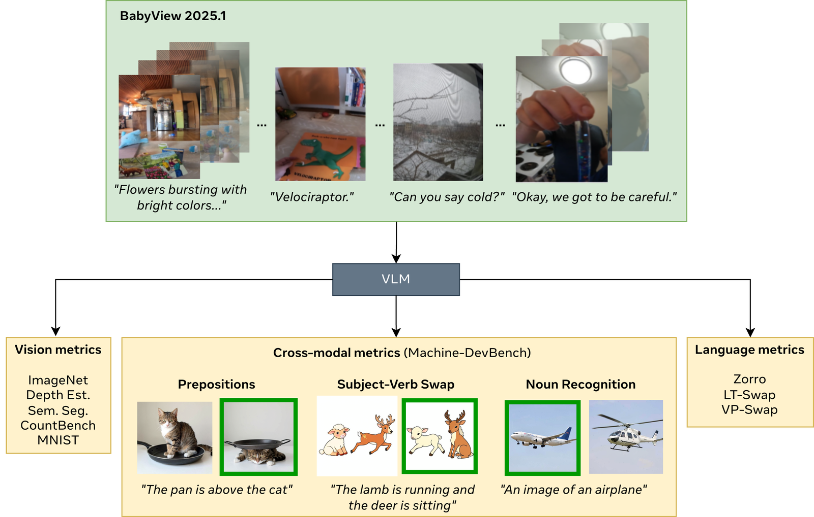

<p align="center">
  <a href="https://facebookresearch.github.io/egobabyvlm/">
    <picture>
      <source media="(prefers-color-scheme: dark)" srcset=".github/assets/banner-dark.svg">
      
    </picture>
  </a>
</p>

<p align="center">
  <a href="https://facebookresearch.github.io/egobabyvlm/"></a>
</p>

<p align="center">
  <a href="https://github.com/facebookresearch/egobabyvlm/actions/workflows/lint_and_test.yaml"></a>
  
  
  <a href="https://pixi.sh"></a>
  <a href="LICENSE"></a>
  <a href="https://arxiv.org/abs/2605.19130"></a>
</p>

Challenge infrastructure for **EgoBabyVLM**. Accompanies the paper
[*EgoBabyVLM: Benchmarking Cross-Modal Learning from Naturalistic Egocentric
Video Data*](https://arxiv.org/abs/2605.19130). Brought to you by researchers
at Meta, Stanford, ENS, and UTokyo.

### The Challenge

Train a VLM on the [BabyView 2025.1](https://databrary.org/volume/1882)
corpus (≈863 h of head-mounted-camera video from children) and nothing
else — no extra image, video, text, or audio data may be used for any
encoder pretraining, fine-tuning, or evaluation. The challenge is to
beat the baselines on a fixed evaluation suite and close the gap to
web-scale pretrained models.

Submissions are scored on three families of tasks, each with subgroup
aggregates and an overall:

| Family | Subgroups | Tasks |
|---|---|---|
| **Cross-modal grounding** ([Machine-DevBench](apps/benchmark_creation/README.md)) | Lexical (2), Grammatical (8) | Noun + adjective recognition; subject-verb / subject-adjective binding; negation; word order; prepositions; comparatives; counting; embedded relatives. ~3,700 contrastive (image, caption) trials sampled from the model's own training vocabulary across log-frequency bins. |
| **Vision** | Object recognition (6), Visual properties (3) | ImageNet-1k (k-NN, linear, ABX); MNIST (linear, ABX); COCO-Stuff segmentation; NYUv2 depth; CountBench (linear, ABX). |
| **Language** | Syntax (3), Semantics (2) | Zorro; LongTail-Swap (Inflection, Agreement, Word); Visual-Property Swap (color, material, size, shape). |

<p align="center">
  
</p>

The paper shows weakly-aligned naturalistic egocentric input drives
contrastive and generative reference baselines to near-chance on the
cross-modal probes, while curated captions (COCO) approach off-the-shelf
CLIP. The challenge is to close that gap to web-scale pretrained models
algorithmically, without changing the data.

### Repository layout

Each directory under `apps/` has a README with component-specific
usage.

<details>
<summary>Top-level tree</summary>

```
apps/
├── data_preprocessing/   # video → frames + WhisperX transcripts + train/val/test manifests
├── baselines/
│   ├── dinov2/           # DINOv2 SSL + ViT-B/14 feature extractor
│   ├── lm_training/      # BERT MLM and GPT-2 from-scratch trainers
│   ├── clip/             # CLIP+ contrastive trainer (4 modes: contrastive, +MLM, +DINOv2, triple)
│   └── llava/            # EgoBabyLLaVA generative VLM trainer
├── alignment_scoring/    # CLIP / VQA / STS / captioning pipelines for cross-modal alignment scoring
├── benchmark_creation/   # Machine-DevBench corpus-grounded benchmark generator
└── swapbench/            # LongTail-Swap + VP-Swap generators
core/                     # Protocols (FeatureExtractor, …), DDP / config / seed utils
evaluation/               # Hydra+Stopes eval pipeline (vision, text, multimodal task launchers)
docs/                     # Per-component design notes
scripts/eval_data/        # Eval-dataset download helpers
tests/                    # Unit + opt-in integration tests
```
</details>

### Submitting

A submission is leaderboard scores plus, ideally, the training code that
produced them. The minimum end-to-end path:

1. **Cache the eval datasets** — see
   [`docs/eval_data.md`](docs/eval_data.md). The download scripts handle
   the open-access ones automatically; only ImageNet and NYUv2 need a
   one-time manual prep documented inline.
2. **Validate the eval setup on an off-the-shelf model** — point the
   `evaluation/eval_launcher` at `model=dino` / `model=clip_image` /
   `model=bert_base` to sanity-check that the three eval families run
   on your machine and reproduce numbers in the same ballpark as the
   leaderboard's off-the-shelf rows.
3. **Train your own model on BabyView** — any architecture, any
   objective, as long as the training data comes only from BabyView
   2025.1 (no extra image / video / text / audio data for pretraining,
   fine-tuning, or evaluation).
4. **Score your model** with `evaluation/eval_launcher` over the three
   families.
5. **Open a PR against the leaderboard repo** with a JSON file
   containing your scores **and a link to the training code** so the
   submission can be reproduced. See the
   [leaderboard submission page](https://facebookresearch.github.io/egobabyvlm/submit.html)
   for the JSON schema and PR template.

> [!IMPORTANT]
> Submissions are marked **verified** when we can reproduce the scores
> from the provided code. Leaderboard-only submissions (a
> paper / report with numbers but no runnable code) are still welcome
> and will appear on the board, but won't carry the verified mark.

> [!TIP]
> For validation and method exploration we recommend training on
> [Ego4D](https://ego4d-data.org/) rather than BabyView. Ego4D is
> naturalistic egocentric video too — just not developmentally
> plausible — and is faster to iterate on (more shards, fewer access
> hoops). Then re-train your final submission on BabyView 2025.1.

### Reference baselines

The `apps/baselines/` trees ship the four trainers we used in the paper,
along with `apps/data_preprocessing/` for the BabyView → manifest
pipeline they consume. Useful as starting points, sanity checks, or
warm-starts for your own approach — but bring your own trainer if you
prefer; the challenge encourages alternative architectures, objectives,
and curricula.

<details>
<summary>What's shipped + how to plug in an alternative architecture</summary>

- `apps/baselines/dinov2/` — DINOv2 SSL (ViT-B/14).
- `apps/baselines/lm_training/` — BERT MLM and GPT-2 from-scratch.
- `apps/baselines/clip/` — CLIP+ contrastive trainer with four modes
  (contrastive, +MLM, +DINOv2, triple).
- `apps/baselines/llava/` — EgoBabyLLaVA generative VLM trainer.
- `apps/data_preprocessing/` — video → frames + WhisperX transcripts →
  `(frame, utterance)` manifests.

**Plugging in an alternative architecture.** The eval launcher
dispatches to whatever model class your config `_target_` points at.
Make your model compatible by implementing one of the protocols in
[`core/protocols/feature_extractor.py`](core/protocols/feature_extractor.py):

- `ImageFeatureExtractor` — vision tasks (ImageNet, MNIST, depth,
  segmentation, CountBench).
- `TextFeatureExtractor` — language tasks (Zorro, LT-Swap, VP-Swap).
- `MultiModalFeatureExtractor` — cross-modal grounding
  (Machine-DevBench).
- `VideoFeatureExtractor` — video extractors (not on the default
  evaluation path, but supported by the launcher).

The protocols are `runtime_checkable`, so the launcher fails fast at
startup if a method is missing. Once your class implements the relevant
protocol, drop `evaluation/configs/model/<your_name>.yaml` with
`_target_: path.to.YourExtractor` and pass `model=<your_name>` to
`eval_launcher`. The existing `evaluation/configs/model/*.yaml` files
(`dino.yaml`, `clip_image.yaml`, `llava_vision.yaml`, …) are working
references.
</details>

> [!NOTE]
> `apps/alignment_scoring/`, `apps/benchmark_creation/`, and
> `apps/swapbench/` are toolkits used to produce the paper's analyses
> and benchmarks. Not on the critical path for a submission, but
> useful for re-running those experiments or generating benchmarks for
> a new training corpus.

### Install

The full environment is pinned in [`pixi.toml`](pixi.toml) (Python 3.12,
PyTorch 2.8 + CUDA 12.6).

```bash
# install pixi: https://pixi.sh/latest/installation/
pixi install -e dev
```

This produces installable CLI entry points. The most commonly used:

```text
egobabyvlm-train-contrastive              # apps/baselines/clip/training
egobabyvlm-extract-frames                 # apps/data_preprocessing/frames
egobabyvlm-transcribe-whisperx            # apps/data_preprocessing/transcription
egobabyvlm-build-clip-manifest            # apps/data_preprocessing/manifests
```

<details>
<summary>All installed CLI entry points</summary>

```text
egobabyvlm-extract-frames                 # apps/data_preprocessing/frames
egobabyvlm-transcribe-whisperx            # apps/data_preprocessing/transcription
egobabyvlm-filter-vtc                     # apps/data_preprocessing/transcription (BabyView KCHI)
egobabyvlm-build-clip-manifest            # apps/data_preprocessing/manifests
egobabyvlm-train-contrastive              # apps/baselines/clip/training
egobabyvlm-export-text-encoder-to-hf      # apps/baselines/clip/scripts (BERT → HF for lm_eval)
egobabyvlm-swapbench-build-word-lists     # apps/swapbench (LongTail-Swap + VP-Swap)
egobabyvlm-swapbench-lt-swap              # apps/swapbench
egobabyvlm-swapbench-vp-swap              # apps/swapbench
alignment-{clip,sts,vqa}-scoring          # apps/alignment_scoring
alignment-captioning                      # apps/alignment_scoring
alignment-finetune-lora                   # apps/alignment_scoring (LoRA finetune)
alignment-create-shuffled-manifest        # apps/alignment_scoring
```

DINOv2, LLaVA, BERT, GPT-2, Machine-DevBench generation, and the
evaluation launcher are invoked via `pixi run -e dev python -m apps.<…>`
or `pixi run -e dev python -m evaluation.…`. See the corresponding
component READMEs.
</details>

### Quickstart

#### Run an evaluation

Download the eval datasets once (see
[`docs/eval_data.md`](docs/eval_data.md)), then point the launcher at
your model:

```bash
# All vision tasks
pixi run -e dev python -m evaluation.eval_launcher \
    eval=vision/vision_pipeline \
    model=dino \
    name=my_run

# All Machine-DevBench tasks (realistic + cartoon styles)
pixi run -e dev python -m evaluation.eval_launcher \
    eval=multimodal/machine_devbench_pipeline \
    model=clip_image \
    name=my_run

# All text tasks
pixi run -e dev python -m evaluation.eval_launcher \
    eval=text/text_pipeline \
    model=bert_base \
    name=my_run
```

Override `model=…` to swap encoders, or any individual task YAML in
`evaluation/configs/eval/`. Off-the-shelf model configs (`dino`,
`clip_image`, `bert_base`, …) are useful for sanity-checking the eval
setup before plugging in your own.

#### Train a reference baseline (optional)

The shipped baselines reproduce paper numbers and can serve as starting
points.

<details>
<summary>CLIP+ (contrastive) — triple mode on Ego4D</summary>

```bash
pixi run -e dev torchrun --standalone --nproc-per-node=4 \
    -m apps.baselines.clip.training.train \
    name=babyview_clip mode=triple data=ego4d \
    data.train_dataset.manifest_path=/path/to/manifests/train.json \
    data.train_dataset.image_root=/path/to/frames \
    data.val_dataset.manifest_path=/path/to/manifests/val.json \
    +text_only_data=default text_only_data.train_file=/path/to/utterances.txt \
    +dinov2=vitb14_coco
```

`data=ego4d` selects the multi-frame-per-utterance loader used for
BabyView, Ego4D, and HowTo. For COCO use `data=coco`. See
[`apps/baselines/clip/README.md`](apps/baselines/clip/README.md) for
the other modes and the single-GPU recipe.
</details>

<details>
<summary>EgoBabyLLaVA (generative) — Phase 1 + Phase 2</summary>

```bash
sbatch apps/baselines/llava/scripts/phase1_pretrain.sh
sbatch apps/baselines/llava/scripts/phase2_finetune.sh
```

See [`apps/baselines/llava/README.md`](apps/baselines/llava/README.md)
for the three-phase recipe (GPT-2 from scratch → projector → joint
fine-tune).
</details>

### Tests

```bash
pixi run -e dev ci   # ruff check + format + typos + pytest
```

GPU- and integration-marked tests are excluded by default; opt in with
`pytest -m gpu` or `pytest -m integration`.

### Citing our work

If you use our benchmark or find our work useful in your research,
please consider citing:

```bibtex
@article{lin2026egobabyvlm,
  title   = {EgoBabyVLM: Benchmarking Cross-Modal Learning from Naturalistic Egocentric Video Data},
  author  = {Lin, Dongyan and Rust, Phillip and Villar-Corrales, Angel and Tan, Alvin W. M.
             and Luthra, Mahi and Saint-James, Charles-{\'E}ric and Moritz, Rashel
             and Krogh-Jespersen, Sheila and Stark, Vanessa and Parimi, Surya
             and Shen, Jiayi and Benchekroun, Youssef and Higuchi, Yosuke
             and Gleize, Martin and Fizycki, Tom and Hamilakis, Nicolas
             and Khentout, Manel and Tsuji, Sho and K{\'e}gl, Bal{\'a}zs
             and Pino, Juan and Frank, Michael C. and Dupoux, Emmanuel},
  journal = {arXiv preprint},
  year    = {2026},
  url     = {https://arxiv.org/abs/2605.19130},
}
```

### Licenses

The majority of EgoBabyVLM is licensed under [CC-BY-NC 4.0](LICENSE),
with the following exceptions:

| Component | Path | License |
|---|---|---|
| DINOv2 | `apps/baselines/dinov2/third_party/dinov2/` | Apache License 2.0 (per-file headers) |
| Perception Encoder | `apps/alignment_scoring/third_party/perception_models/` (PE portion) | [Apache License 2.0](apps/alignment_scoring/third_party/perception_models/LICENSE.PE) |
| Perception-LM | `apps/alignment_scoring/third_party/perception_models/` (PLM portion) | [FAIR Noncommercial Research License](apps/alignment_scoring/third_party/perception_models/LICENSE.PLM) |
| LongTail-Swap | `apps/swapbench/third_party/lt_swap/` | [CC-BY-NC 4.0](apps/swapbench/third_party/lt_swap/LICENSE) |
| LLaVA-derived code | `apps/baselines/llava/` | Apache License 2.0 (per-file headers) |

Please retain all upstream copyright notices and license headers when
reusing files from these directories.

The released **data** is CC-BY-NC and intended for benchmarking only.
Some annotations are outputs of Llama 3.1 and subject to its license
([Llama 3.1 license](https://github.com/meta-llama/llama-models/blob/main/models/llama3_1/LICENSE);
[Llama 4 model card](https://github.com/meta-llama/llama-models/tree/main/models/llama4)).
Third-party content pulled from other locations is subject to its own
licenses, and you may have other legal obligations governing your use of
that content.
